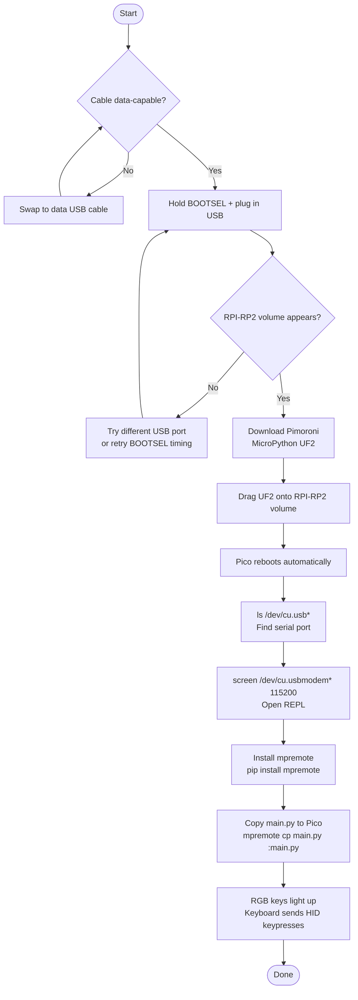

# steam-pi

RGB macro keyboard (Stream Deck style) built with a Raspberry Pi Pico 2 W.

---

## Project Structure

```
steam-pi/
├── Formulas/
│   ├── connect-pico2w-mac.md        # How to connect Pico 2 W to MacBook
│   ├── pico2w-keyboard-pins.md      # Pin layout and keyboard matrix explained
│   └── setup-pico-rgb-keyboard.md   # Full setup guide for RGB keyboard
└── Semblance/
    └── pico2w-connection-issues.md  # Known/unresolved connection issues
```

---

## Setup Flow



---

## Hardware

- Raspberry Pi Pico 2 W (RP2350, wireless)
- Pimoroni RGB Keypad Base (4×4, 16 APA102 RGB keys)
- USB data cable

---

## Quick Start

1. Flash Pimoroni MicroPython UF2 onto the Pico 2 W (hold BOOTSEL, plug in USB)
2. Copy `main.py` to the Pico using `mpremote`
3. Keys light up with RGB colors and send USB HID keypresses to the host

See [`Formulas/setup-pico-rgb-keyboard.md`](Formulas/setup-pico-rgb-keyboard.md) for full steps.

---

## Connecting Pico 2 W to Mac

```bash
# Find serial port
ls /dev/cu.usb*

# Connect to REPL
screen /dev/cu.usbmodem* 115200
```

See [`Formulas/connect-pico2w-mac.md`](Formulas/connect-pico2w-mac.md) for troubleshooting.

---

## Known Issues

See [`Semblance/pico2w-connection-issues.md`](Semblance/pico2w-connection-issues.md) for unresolved connection problems encountered during setup.
